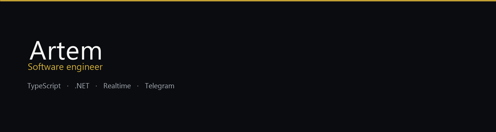

  

Собираю продукты целиком: интерфейс, API и живое состояние в одном контуре. Веб-платформы, Telegram Mini Apps, realtime. Довожу до деплоя, а не до папки с прототипом.

[Telegram](https://t.me/Roomzrly) · [rudenbelstad@gmail.com](mailto:rudenbelstad@gmail.com)

| Слой | Стек |
|---|---|
| Frontend | TypeScript, React, Next.js, Vite, Expo |
| Backend | Node.js, NestJS, ASP.NET Core, WebSocket, Socket.IO |
| Data | PostgreSQL, Redis, Prisma |
| Delivery | Docker, Git, Telegram Mini Apps |

### Избранное

**[PicksMaps](https://github.com/RoomzR/PicksMaps)** — вето карт в Telegram. Матч, баны, пики и выбор стороны в одном realtime-потоке.

**[AnalyticsCS2](https://github.com/RoomzR/AnalyticsCS2)** — разбор демо: карта, раунды, гранаты, привычки игрока. API и интерфейс в одном приложении.

**[CyberXFull](https://github.com/RoomzR/CyberXFull)** — веб-платформа клуба: турниры, рейтинг, админка, отдельный API и клиент.

**[CyberXTasks](https://github.com/RoomzR/CyberXTasks)** — задачи команды в Telegram Mini App, с ботом только для уведомлений.

**[TravelAgency](https://github.com/RoomzR/TravelAgency)** — платформа турагентства на ASP.NET Core, со слоями Web, BLL и DAL.
